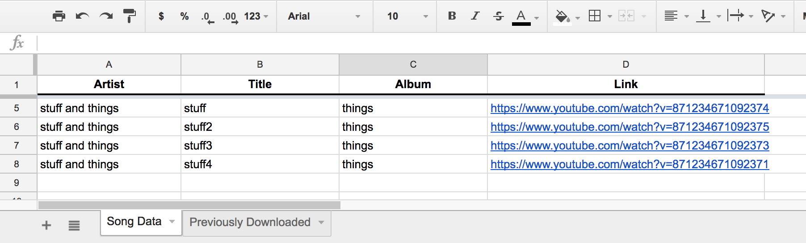

# drive-tunes

A wrapper around [youtube-dl](https://github.com/rg3/youtube-dl) to scrape mp3s from a spreadsheet in google drive. Follow the first part in the [sheets api quickstart](https://developers.google.com/sheets/api/quickstart/python) to get a working `client_secret.json` (and make sure that's what it's named). 

needs the following:
```bash
sudo apt-get install python3-pip
sudo apt-get install python3-venv
git clone https://github.com/glaaki/drive-tunes.git
python3 -m venv drive-tunes/
source drive-tunes/bin/activate
pip install -r drive-tunes/requirements.txt
```
also needs ffmpeg installed: `sudo apt-get install libav-tools` for 'nix/wsl or `brew install libav` for mac.

### todo
* Modify to automatically copy to the proper directory.

### example sheet
The second tab is formatted exactly the same as `Song Data`, downloaded items are appended there just in case.

